# Semantic-Image-Synthesis

Model that generates paintings in the style of Bob Ross. It takes segmentation image as an input. 

## Exmaples of GauGAN

<table>
  <tr>
      <td>Segmentation Map</td>
      <td>Ground Truth</td>
      <td>Generated Image</td>
  </tr>
  <tr>
    <td>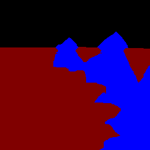</td>
    <td>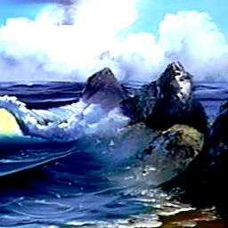</td>
    <td>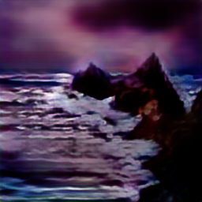</td>
  </tr>
  <tr>
    <td></td>
    <td>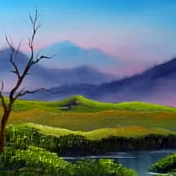</td>
    <td>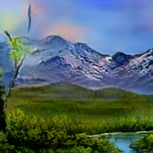</td>
  </tr>
  <tr>
    <td>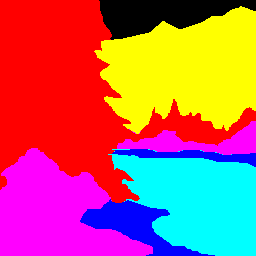</td>
    <td>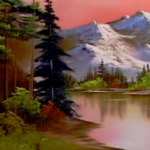</td>
    <td>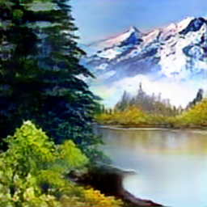</td>
  </tr>
 </table>

## Exmaples of Pix2Pix

<table>
  <tr>
      <td>Segmentation Map</td>
      <td>Ground Truth</td>
      <td>Generated Image</td>
  </tr>
  <tr>
    <td>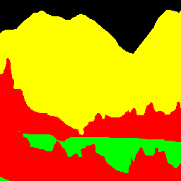</td>
    <td>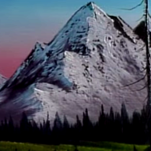</td>
    <td>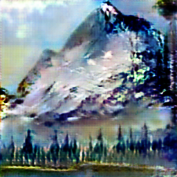</td>
  </tr>
 </table>
